English | [简体中文](./README.md)
# 🚀 EveryoneAgent

<div align="center">


# EveryoneAgent

### A Modular AI Agent Framework for Local AI Intelligence

**FastAPI · LangGraph · ONNX Runtime · vLLM · YOLOv8 · BERT · SQLite**


</div>


EveryoneAgent is a lightweight, modular, local-first AI agent framework that integrates FastAPI, LangGraph, MCP Tools, ONNX Runtime, vLLM, YOLO, and BERT. It supports local model inference, agent workflows, session memory, tool calls, and knowledge management.

EveryoneAgent explores a new agent model: the collaborative work of a local specialized model and an external API.

Testing has shown that using the local model + API model reduces token consumption by approximately 11%.

This effectively solves specialized business problems within enterprises while reducing the risk of enterprise local data leakage to public networks.


---

# ✨ Features

## 🤖 AI Agent

EveryoneAgent provides a complete Agent architecture:

- Agent
- Planner
- Workflow Engine
- Memory System
- Conversation Management
- Prompt Management
- Tool Calling
- Knowledge Retrieval


---

## 🧠 AI Model Support

Supported models:

| Model        | Purpose                         |
| ------------ | ------------------------------- |
| BERT         | Natural Language Classification |
| YOLOv8       | Object Detection                |
| ONNX Runtime | Local AI Inference              |
| vLLM         | Large Language Model Serving    |
| Local LLM    | Private AI Deployment           |


---

## 🌐 Web Framework

Built with:

- FastAPI
- Jinja2
- TailwindCSS
- SQLite
- SQLAlchemy


---

# 🚀 Why EveryoneAgent?

Many AI Agent frameworks rely heavily on external services.

EveryoneAgent focuses on:

> **Local First · Modular Design · Easy Deployment**

The goal is to build a complete AI Agent framework that can run locally.

It allows developers to easily integrate:

- New models
- New tools
- New workflows
- New databases
- New knowledge sources


---

# 📚 Table of Contents

- Overview
- Architecture
- Project Structure
- Core Modules
- Capability Modules
- Infrastructure
- Knowledge System
- AI Workflow
- Database Design
- Deployment
- Roadmap


---

# 🏗 System Architecture

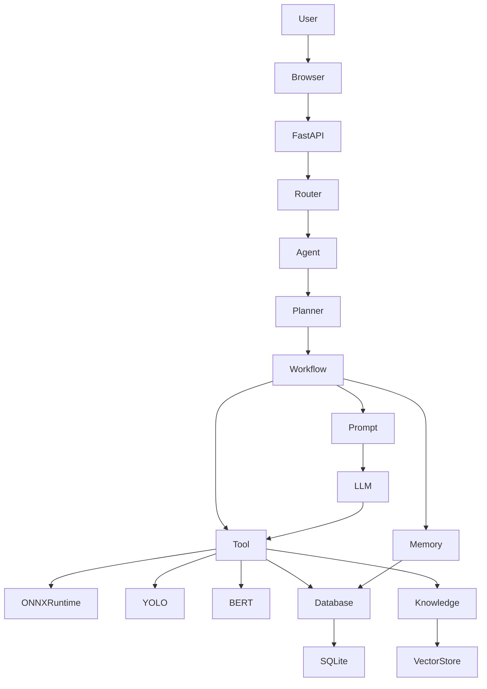

---

# 📂 Project Structure


```text
EveryoneAgent

│

├── Core

│

├── Capability

│

├── Infrastructure

│

├── Knowledge

│

├── Static

│

├── Templates

│

├── Database

│

├── Config

│

├── Logs

│

├── Models

│

├── main.py

│

├── requirements.txt

│

└── README.md

```


---

# 🏛 Layered Architecture


EveryoneAgent follows a layered architecture:


```text
+---------------------------+
|        Web Layer          |
+---------------------------+
|       Router Layer        |
+---------------------------+
|       Agent Layer         |
+---------------------------+
|      Workflow Layer       |
+---------------------------+
|     Capability Layer      |
+---------------------------+
|  Infrastructure Layer     |
+---------------------------+
|      Database Layer       |
+---------------------------+

```


Each layer has a clear responsibility.

This design provides:

- Low coupling
- High scalability
- Easy maintenance
- Flexible extension


---

# 🔄 Request Flow


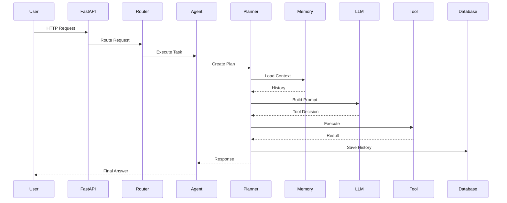

---

# 🚀 Quick Start


Clone repository:


```bash
git clone https://github.com/yourname/EveryoneAgent.git

cd EveryoneAgent
```


Install dependencies:


```bash
pip install -r requirements.txt
```


Start:


```bash
python main.py
```


Open:


```
http://127.0.0.1:8000
```


---

# 📦 Core Architecture

The Core layer is the heart of EveryoneAgent.

It controls:

- Agent execution
- Task planning
- Workflow orchestration
- Memory management
- Conversation handling
- Prompt construction
- Local AI inference


The Core layer does not contain specific business implementations.

Its responsibility is:

> **Thinking + Scheduling + Execution**

---

# Core Architecture


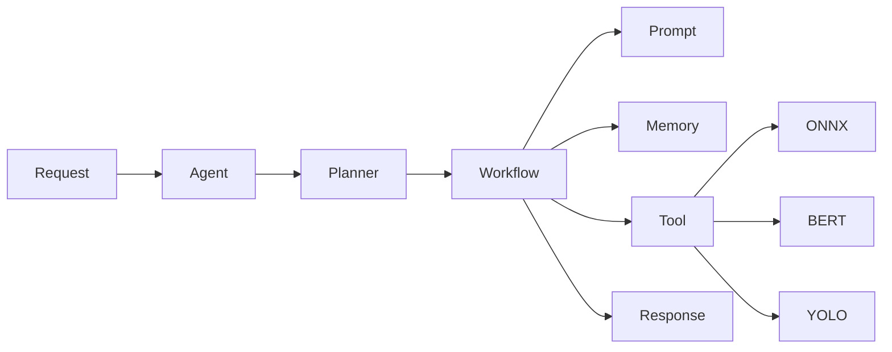

---

# 🤖 Agent


```text
Core/

└── Agent
```


Agent is the brain of EveryoneAgent.

All user requests enter the Agent layer first.


Agent responsibilities:

- Receive requests
- Create tasks
- Call Planner
- Execute workflows
- Return results


---

# Agent Lifecycle


---

# Agent Responsibilities


| Function         | Description              |
| ---------------- | ------------------------ |
| Request Handling | Receive user requests    |
| Task Creation    | Generate execution tasks |
| Planning         | Call Planner             |
| Execution        | Run workflows            |
| Response         | Return final output      |


---

# 🧩 Planner


```text
Core/

└── Planner
```


Planner is the decision-making center.

It does not execute tasks directly.

Instead, it decides:

- What should be done?
- Which tool should be used?
- Should memory be loaded?
- Should knowledge be searched?
- Which model should be called?


Planner answers:

> "What should happen next?"


---

# Planner Workflow


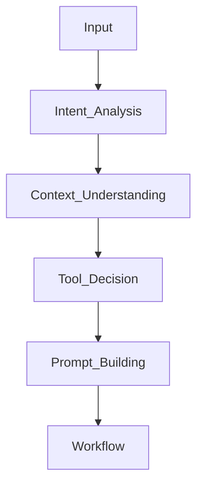


---

# Planner Responsibilities


| Function            | Description               |
| ------------------- | ------------------------- |
| Intent Analysis     | Understand user intention |
| Task Planning       | Create execution plan     |
| Tool Selection      | Select proper capability  |
| Memory Access       | Load historical context   |
| Prompt Construction | Build model input         |


---

# 🔄 Workflow


```text
Core/

└── Workflow
```


Workflow executes the plan created by Planner.


EveryoneAgent uses workflow-based execution.

Workflow is responsible for:

- Step execution
- Tool calling
- Model calling
- Result processing


---

# Workflow Example


User:

```
Detect objects in this image
```


Workflow:


```
Image

↓

YOLO_Model

↓

ONNX_Runtime_DLL

↓

Post_Processing

↓

Detection_Result

```


---

# Workflow Architecture


---

# 🧠 Memory


```text
Core/

└── Memory
```


Memory provides context awareness.

It allows Agent to remember:

- Previous conversations
- User information
- Execution history
- Intermediate results


---

# Memory Types


```text
Memory

├── Session Memory

├── Conversation Memory

├── Cache

└── Long Term Memory

```


---

# Memory Workflow


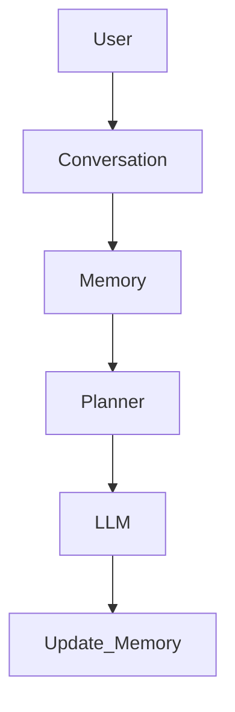


---

# 💬 Conversation


```text
Core/

└── Conversation
```


Conversation manages chat history.

It provides:

- Create conversation
- Query history
- Store messages
- Multi-turn conversation


---

# Conversation Lifecycle


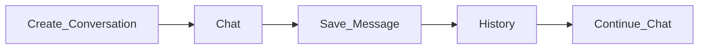


---

# 📝 Prompt


```text
Core/

└── Prompt
```


Prompt module manages all prompt templates.

Including:

- System Prompt
- User Prompt
- Tool Prompt
- Memory Prompt


---

# Prompt Pipeline


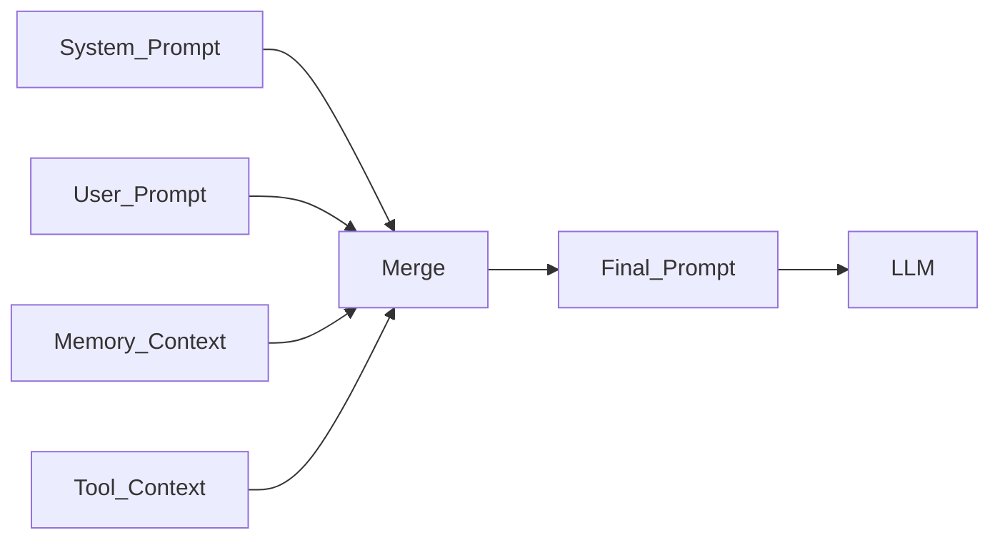


---

# ⚡ ONNX Runtime


```text
Core/

└── ONNX
```


ONNX Runtime provides local AI inference.


Supported models:

- YOLOv8
- BERT


Advantages:

- Fast inference
- CPU/GPU support
- CUDA acceleration
- Cross-platform deployment


---

# ONNX Inference Pipeline


```mermaid
graph LR


Input

-->

Preprocess

-->

Tensor

-->

ONNX Runtime

-->

Output Tensor

-->

Postprocess

-->

Result

```


---

# 🔐 Session Management


Session maintains user runtime state.


Including:

- Login status
- User information
- Current conversation
- Authentication state


---

# Session Lifecycle


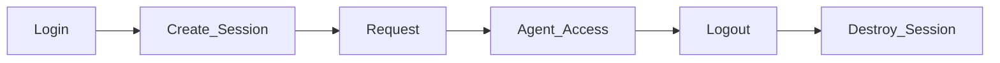


---

# Core Summary


The Core layer provides the intelligence engine of EveryoneAgent.


It is responsible for:

- Agent reasoning
- Task planning
- Workflow execution
- Memory management
- Conversation management
- Prompt generation
- Model invocation


The Core layer follows:

> **High Cohesion · Low Coupling · Easy Extension**

---

# 🧩 Capability Layer

The Capability layer provides actual abilities for EveryoneAgent.

The Core layer decides:

> "What should be done?"

The Capability layer decides:

> "How to do it?"

---

# Capability Architecture


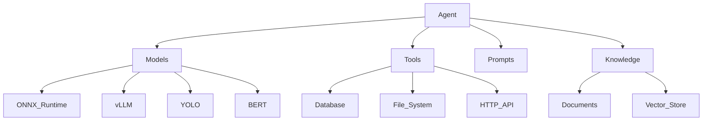

---

# Capability Structure


```text
Capability

│

├── Models

│

├── Tools

│

├── Prompts

│

└── Knowledge

```


The Capability layer adopts a plugin architecture.

New abilities can be added without modifying the Agent core.

---

# 🤖 Models


```text
Capability

└── Models
```


The Models module manages all AI models.

Supported models:


| Model        | Function            |
| ------------ | ------------------- |
| BERT         | Text classification |
| YOLOv8       | Object detection    |
| ONNX Runtime | Local inference     |
| vLLM         | LLM serving         |
| Local LLM    | Private deployment  |


---

# Model Pipeline


---

# ⚡ ONNX Runtime


EveryoneAgent uses ONNX Runtime as the local AI inference engine.


Advantages:


- High performance
- GPU acceleration
- CUDA support
- CPU fallback
- Cross-platform deployment


---

# ONNX Runtime Workflow


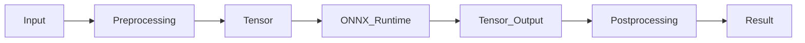

---

# 🐶 YOLOv8 Object Detection


YOLOv8 provides computer vision capability.


Applications:

- Image detection
- Camera detection
- Video analysis


---

# YOLOv8 Pipeline


---

# YOLOv8 Processing


Input:

```
Image
```


↓

Preprocessing:

```
Resize

Normalize

Tensor Conversion
```


↓

Inference:

```
ONNX Runtime
```


↓

Postprocessing:

```
Confidence Filter

NMS

Class Mapping
```


↓

Output:

```
Detection Result
```


---

# 📝 BERT Natural Language Processing


BERT provides NLP capability.


Current usage:

- Text classification
- Sentiment analysis


---

# BERT Pipeline


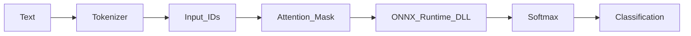

---

# BERT Deployment


Supported:


- HuggingFace fine-tuning
- ONNX export
- GPU inference
- CPU inference


Example:


```
Input:

"This movie is great"


Output:

Positive

Confidence:

0.99

```


---

# 🧠 vLLM Integration


vLLM provides large language model serving.


EveryoneAgent uses an OpenAI-compatible API interface.


Supported models:


- Qwen
- Llama
- DeepSeek
- Other LLMs


---

# vLLM Architecture


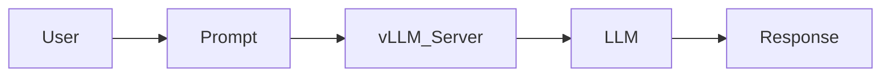

---

# 🛠 Tool Calling


Tools extend Agent capabilities.


Agent decides:

> "Which tool should I call?"


Tool executes:

> "How should the task be completed?"


---

# Tool Architecture


---

# Tool Examples


```text
Tools

├── Database Tool

├── File Tool

├── Image Tool

├── ONNX Tool

├── HTTP Tool

└── Custom Tool

```


---

# Tool Interface


All tools follow a unified interface.


Example:


```python
class BaseTool:

    def execute(self):

        pass

```


Benefits:


- Easy extension
- Loose coupling
- Unified management


---

# 📝 Prompt Templates


Prompt module manages model instructions.


Includes:


- System Prompt
- User Prompt
- Tool Prompt
- Memory Prompt


---

# Prompt Workflow


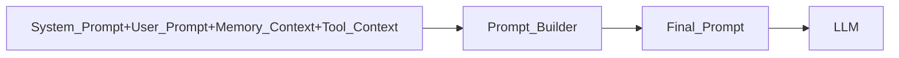

---

# 📚 Knowledge System


Knowledge provides external knowledge for Agent.


It enables:


- Document understanding
- Knowledge retrieval
- RAG extension
- Enterprise knowledge base


---

# Knowledge Architecture


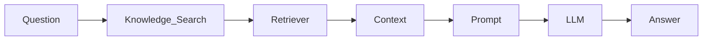

---

# Knowledge Structure


```text
Knowledge


├── Documents


├── Index


├── Retriever


└── VectorStore

```


---

# Documents


Stores original knowledge sources.


Supported:


- Markdown
- TXT
- PDF
- Code
- Web Content


---

# Knowledge Processing


```mermaid
graph LR


Document

-->

Loader

-->

Parser

-->

Chunk

-->

Embedding

-->

Index

```

---

# Vector Store


Future support:


- FAISS
- Milvus
- PostgreSQL Vector


Workflow:


```mermaid
graph LR

Text

-->

Embedding

-->

Vector

-->

Storage

-->

Similarity_Search

```

---

# Capability Summary


The Capability layer provides:

- AI model integration
- Local inference
- Tool execution
- Prompt management
- Knowledge retrieval


It transforms EveryoneAgent from a chatbot into a complete AI capability platform.

---

# 🏗 Infrastructure Layer

The Infrastructure layer provides the foundation for EveryoneAgent.

It is responsible for:

- Web service
- Database
- User management
- Configuration
- Storage
- Logging
- Deployment


The Infrastructure layer does not contain AI reasoning logic.

Its responsibility is:

> **Make the AI system stable, reliable, and production-ready.**

---

# Infrastructure Architecture


```mermaid
graph TD


Application

-->

FastAPI

Application

-->

Database

Application

-->

Config

Application

-->

Logging

Application

-->

Storage


FastAPI

-->

Router


Router

-->

Service


Service

-->

Database


Database

-->

SQLite

```

---

# Infrastructure Structure


```text
Infrastructure


│

├── API


│

├── Database


│

├── Storage


│

├── Config


│

├── Logging


│

└── Deployment

```

---

# 🌐 FastAPI


FastAPI is the main web service framework.


It provides:

- HTTP API
- Request handling
- Data validation
- Response serialization
- Service communication


---

# FastAPI Architecture


```mermaid
graph LR


Client

-->

FastAPI

-->

Router

-->

Service

-->

Core

-->

Response

```

---

# 📡 API Layer


The API layer exposes system capabilities through RESTful interfaces.


Main modules:


```text
API


├── Authentication


├── User


├── Conversation


├── Chat


└── Model

```


---

# API Design


Example:


```text
/api


├── auth


│
├── register


│
├── login


│
└── logout


├── conversation


│
├── create


│
├── list


│
└── history


├── chat


│
└── completion


└── model


    └── inference

```

---

# 👤 User Management


The user system provides:


- Registration
- Login
- Authentication
- Session management


---

# User Lifecycle


```mermaid
graph LR


Register

-->

Create_User

-->

Login

-->

Create_Session

-->

Use_Agent

-->

Logout

```

---

# 🗄 Database System


EveryoneAgent uses:


- SQLite
- SQLAlchemy ORM


Advantages:


- Lightweight
- Easy deployment
- Object-oriented database access
- Easy migration to PostgreSQL


---

# Database Architecture


```mermaid
graph TD


Application

-->

SQLAlchemy_ORM

-->

Database_Engine

-->

SQLite

-->

Tables

```

---

# Database ER Design


```mermaid
erDiagram


USER {


int id

string username

string email

string password

datetime created_at

}


CONVERSATION {


int id

int user_id

string title

datetime created_at

}


MESSAGE {


int id

int conversation_id

string role

text content

datetime created_at

}


USER ||--o{ CONVERSATION : owns


CONVERSATION ||--o{ MESSAGE : contains

```

---

# 👥 User Table


Stores user information.


| Field      | Description   |
| ---------- | ------------- |
| id         | User ID       |
| username   | Username      |
| email      | Email address |
| password   | Password      |
| created_at | Creation time |


---

# 💬 Conversation Table


Stores user conversations.


Functions:


- Multi-turn conversation
- History management
- Memory support


| Field      | Description        |
| ---------- | ------------------ |
| id         | Conversation ID    |
| user_id    | Owner              |
| title      | Conversation title |
| created_at | Created time       |


---

# 📨 Message Table


Stores conversation messages.


Example:


```
User:

Hello


Assistant:

Hello, how can I help you?

```


Fields:


| Field           | Description          |
| --------------- | -------------------- |
| role            | user / assistant     |
| content         | Message content      |
| conversation_id | Related conversation |


---

# 💾 Storage System


Storage manages files and resources.


Including:


- Uploaded files
- Images
- Documents
- Model files
- Cache


---

# Storage Structure


```text
Storage


├── uploads


├── models


├── documents


└── cache

```

---

# ⚙️ Configuration System


Config manages all runtime settings.


Including:


- Database configuration
- Model path
- GPU settings
- Server settings
- Environment variables


---

# Configuration Structure


```text
Config


├── Database


├── Model


├── Server


├── Security


└── Runtime

```

---

# 📝 Logging System


Logging records system operations.


Includes:


- API requests
- Agent execution
- Model inference
- Exceptions


---

# Logging Flow


```mermaid
graph LR


Request

-->

Service

-->

Logger

-->

LogStorage

```

---

# 🐳 Deployment


EveryoneAgent supports:


- Windows
- Linux
- Docker
- GPU servers


---

# Docker Architecture


```mermaid
graph TD


Docker


Docker --> FastAPI


Docker --> vLLM


Docker --> Database


Docker --> ONNXRuntime


GPU

-->

CUDA

-->

Container

```

---

# Local Deployment


Environment:


```text
Python >= 3.10

CUDA >= 12

PyTorch

ONNX Runtime

FastAPI

SQLite

```


Installation:


```bash
pip install -r requirements.txt
```


Start:


```bash
python main.py
```

---

# Production Deployment


Recommended architecture:


```text
              User

                |

              Nginx

                |

             FastAPI

                |

        ----------------

        |              |

      Agent          vLLM

        |

  ONNX Runtime

        |

       GPU

```

---

# Infrastructure Summary


The Infrastructure layer provides:


- Stable service
- Data persistence
- User management
- API communication
- Configuration management
- Logging
- Deployment support


It transforms EveryoneAgent from a prototype into an engineering-ready AI system.

---

# 📚 Knowledge System

The Knowledge layer provides external knowledge capabilities for EveryoneAgent.

Unlike traditional chatbots, EveryoneAgent can combine:

- Model knowledge
- User history
- External documents
- Enterprise knowledge


The Agent can retrieve relevant information and use it as additional context during reasoning.

---

# Knowledge Architecture


```mermaid
graph TD


User

-->

Question


Question

-->

Knowledge


Knowledge

-->

Retriever


Retriever

-->

Context


Context

-->

Prompt


Prompt

-->

LLM


LLM

-->

Answer

```

---

# Knowledge Structure


```text
Knowledge


├── Documents


├── Index


├── Retriever


└── VectorStore

```

---

# 📄 Documents


Documents store original knowledge sources.


Supported formats:


- Markdown
- TXT
- PDF
- Code
- Web Content


---

# Document Processing Pipeline


```mermaid
graph LR


Document

-->

Loader

-->

Parser

-->

Chunk

-->

Embedding

-->

Index

```

---

# 🔎 Index


The Index module improves knowledge retrieval efficiency.


Responsibilities:


- Document segmentation
- Content indexing
- Fast retrieval


---

# 🧠 Vector Store


Vector databases provide semantic search capability.


Future supported systems:


- FAISS
- Chroma
- Milvus
- PostgreSQL Vector


---

# Vector Search Workflow


```mermaid
graph LR


Text

-->

Embedding

-->

Vector

-->

Storage

-->

SimilaritySearch

-->

Context

```

---

# 🤖 Complete Agent Workflow


The complete EveryoneAgent workflow:


```mermaid
sequenceDiagram


participant User

participant API

participant Agent

participant Planner

participant Memory

participant Knowledge

participant LLM

participant Tool


User->>API: Send Message


API->>Agent: Create Task


Agent->>Memory: Load History


Memory-->>Agent: Context


Agent->>Planner: Analyze Task


Planner->>Knowledge: Search Information


Knowledge-->>Planner: Relevant Context


Planner->>LLM: Build Prompt


LLM-->>Planner: Reasoning Result


Planner->>Tool: Execute Tool


Tool-->>Planner: Tool Result


Planner->>Memory: Save Result


Planner-->>Agent: Final Response


Agent-->>API: Return Result


API-->>User: Output

```

---

# 🧠 Agent Decision Examples


## Normal Conversation


```text
User

↓

Agent

↓

LLM

↓

Answer

```

---

## Image Detection


```text
User

↓

Agent

↓

YOLO Tool

↓

ONNX Runtime

↓

Detection Result

↓

Answer

```

---

## Text Classification


```text
User

↓

Agent

↓

BERT Tool

↓

Tokenizer

↓

ONNX Runtime

↓

Classification

↓

Answer

```

---

## Knowledge Question Answering


```text
User

↓

Knowledge Retrieval

↓

Context

↓

LLM

↓

Answer

```

---

# 🔥 Multi Capability Workflow


```mermaid
graph TD


User

-->

Agent


Agent

-->

Decision


Decision

-->

Chat


Decision

-->

Vision


Decision

-->

NLP


Decision

-->

Knowledge


Chat

-->

LLM


Vision

-->

YOLO


NLP

-->

BERT


Knowledge

-->

VectorStore


LLM

-->

Response


YOLO

-->

Response


BERT

-->

Response


VectorStore

-->

Response

```

---

# 🛠 Development Guide


## Environment Requirements


Recommended environment:


```text
Python >= 3.10

CUDA >= 12

PyTorch

ONNX Runtime

FastAPI

SQLAlchemy

SQLite

```

---

# Installation


Clone repository:


```bash
git clone https://github.com/yourname/EveryoneAgent.git

cd EveryoneAgent

```


Install dependencies:


```bash
pip install -r requirements.txt

```

---

# Configuration


Configuration files:


```text
config/


├── database.yaml


├── model.yaml


├── server.yaml


└── runtime.yaml

```

---

# Start Service


```bash
python main.py

```

Service:


```
http://localhost:8000

```

---

# 🧪 Testing


Test structure:


```text
tests


├── test_agent.py


├── test_memory.py


├── test_api.py


├── test_model.py


└── test_database.py

```

---

# 📊 Performance Design


EveryoneAgent focuses on:


## Model Optimization


Support:


- ONNX Runtime
- CUDA Execution Provider
- TensorRT acceleration


---

## Service Optimization


Including:


- Async API
- Session management
- Model cache


---

## Engineering Optimization


Using:


- Modular architecture
- Interface abstraction
- Layer separation


---

# 🗺 Roadmap


## Completed ✅


- [x] FastAPI Web Framework

- [x] User Authentication

- [x] Conversation System

- [x] SQLite Database

- [x] SQLAlchemy ORM

- [x] Agent Framework

- [x] Planner System

- [x] Workflow Engine

- [x] Memory System

- [x] Prompt Management

- [x] Tool System

- [x] ONNX Runtime

- [x] YOLOv8 Detection

- [x] BERT Classification

- [x] vLLM Integration


---

# Future Plans 🚀


- [ ] RAG System

- [ ] Vector Database

- [ ] Multi-Agent Collaboration

- [ ] MCP Protocol Support

- [ ] Voice Assistant

- [ ] Vision Language Model

- [ ] Mobile Application

- [ ] Robot Integration


---

# 🌟 Project Highlights


## Modular AI Architecture


Every component is independent and replaceable.


---

## Local AI Deployment


Supports:


- Private models
- Local inference
- GPU acceleration


---

## Full Stack AI System


EveryoneAgent includes:


- Frontend
- Backend
- Database
- Agent Framework
- AI Models
- Deployment System


---

# 🤝 Contribution


Contributions are welcome.


You can contribute through:


- Issue reports
- Feature requests
- Pull requests


Possible contribution areas:


- New models
- New tools
- New workflows
- Performance optimization


---

# 📜 License


This project is licensed under the MIT License.


---

# ⭐ Support


If EveryoneAgent helps you:


Give this project a ⭐ Star.


Your support helps the project continue improving.


---

# ❤️ About EveryoneAgent


EveryoneAgent aims to:


> Build an open, modular, and local AI Agent framework.


Making everyone able to build their own AI Agent.

---
