# 🚀 EveryoneAgent V1.0

<div align="center">


# EveryoneAgent V1.0

### A Modular AI Agent Framework for Local AI Inference

**FastAPI · LangGraph · ONNX Runtime · vLLM · YOLO · BERT · SQLite**


> **EveryoneAgent** 是一个轻量级、模块化、本地优先（Local First）的 AI Agent 框架，
> 集成 FastAPI、LangGraph、MCP TOOLS、ONNX Runtime、vLLM、YOLO、BERT，
> 支持本地模型推理、Agent 工作流、会话记忆、工具调用以及知识管理。
> 
> Everyone Agent 尝试了一种新的Agent模式，即本地专业模型+外部API的协同工作。
> 
> 经测试，使用本地模型+API的模式，可使Token的消耗数量降低大约11%。
> 
> 在能有效解决企业中的专门业务问题的同时，减少了企业本地数据向公有网络泄露的风险。

</div>

---

# ✨ Features

## 🚀 AI Agent

- Agent Planner
- Workflow Engine
- Conversation Management
- Session Memory
- Prompt Management
- Tool Calling
- Knowledge Management

---

## 🤖 AI Models

支持多种 AI 模型统一接入：

| 模型             | 功能           |
| ---------------- | -------------- |
| BERT             | 文本分类       |
| YOLO             | 图像目标检测   |
| ONNX Runtime DLL | 本地高速推理   |
| vLLM             | 大语言模型服务 |
| Local LLM        | 本地部署模型   |

---

## 🌍 Web Framework

- FastAPI
- RESTful API
- Jinja2
- TailwindCSS
- SQLite
- SQLAlchemy

---

## 📦 Core Advantages

✅ 模块化设计

✅ 本地 AI 推理

✅ GPU 加速

✅ Agent Workflow

✅ Tool Calling

✅ Conversation Memory

✅ ONNX Runtime

✅ vLLM

✅ FastAPI

✅ 易于扩展

---

# 📖 Table of Contents

- Project Overview
- System Architecture
- Project Structure
- Core Modules
- Workflow
- AI Models
- Database Design
- API Design
- Deployment
- Roadmap
- Future Plan

---

# 🎯 Why EveryoneAgent ?

随着 AI Agent 的发展，大多数框架越来越庞大，
不仅依赖大量第三方服务，而且部署成本越来越高。

EveryoneAgent 的目标非常简单：

> **打造一个轻量级、可扩展、完全本地运行的 AI Agent Framework。**

整个项目遵循：

- Local First
- Modular Design
- Easy Deployment
- Easy Extension
- High Performance

所有模块之间完全解耦。

每个模块都可以独立开发。

整个框架能够快速接入：

- 新模型
- 新工具
- 新工作流
- 新数据库
- 新知识库

而无需修改核心代码。

---

# 🏗 Overall Architecture

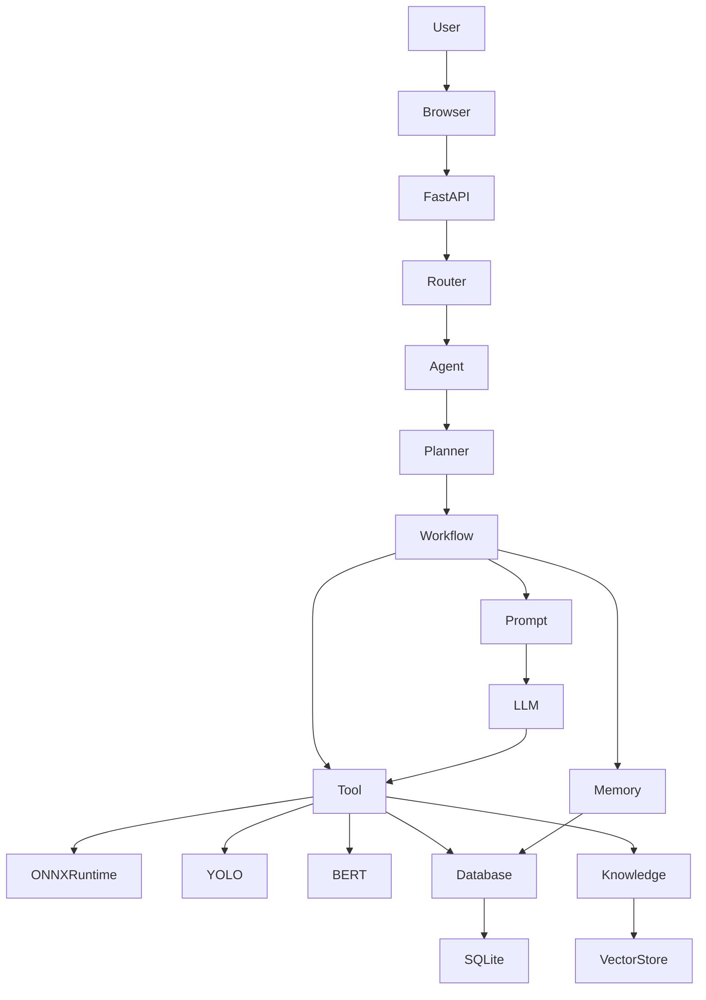

---

# 📂 Project Structure

```text
EveryoneAgent
│
├── Core
│
├── Capability
│
├── Infrastructure
│
├── Knowledge
│
├── Static
│
├── Templates
│
├── Database
│
├── Router
│
├── Config
│
├── Logs
│
├── Models
│
├── main.py
│
├── requirements.txt
│
└── README.md
```

整个项目采用 **分层架构（Layered Architecture）**。

不同层之间仅通过接口通信。

降低耦合。

方便维护。

方便扩展。

---

# 🧠 Layer Design

```text
┌──────────────────────────────┐
│          Web Layer           │
├──────────────────────────────┤
│        Router Layer          │
├──────────────────────────────┤
│        Agent Layer           │
├──────────────────────────────┤
│       Workflow Layer         │
├──────────────────────────────┤
│      Capability Layer        │
├──────────────────────────────┤
│     Infrastructure Layer     │
├──────────────────────────────┤
│      Database Layer          │
└──────────────────────────────┘
```

每一层都拥有独立职责。

禁止跨层调用。

所有请求统一经过 Agent 调度。

---

# ⚙️ Request Flow

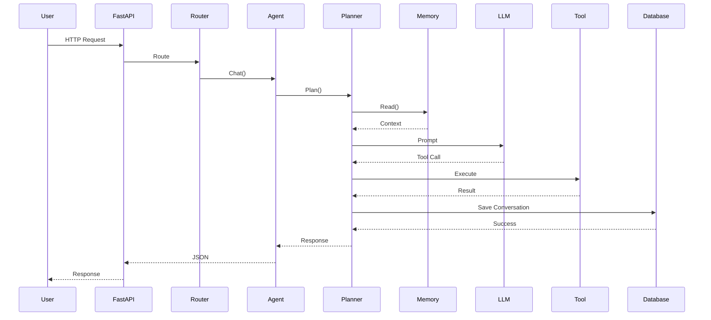

---

# 🏛 Framework Philosophy

EveryoneAgent 并不是一个简单的聊天机器人。

它更像一个可以不断成长的 AI Operating System。

整个框架围绕以下几个核心思想构建：

- Agent 是整个系统的大脑
- Workflow 负责任务编排
- Prompt 负责模型输入
- Tool 提供能力扩展
- Memory 提供上下文
- Knowledge 提供知识支持
- ONNX Runtime 提供本地 AI 推理
- vLLM 提供大模型服务
- FastAPI 提供统一接口

每一个模块都可以独立升级，而不会影响整个系统。

---

# 🚀 Quick Start

```bash
git clone https://github.com/yourname/EveryoneAgent.git

cd EveryoneAgent

pip install -r requirements.txt

python main.py
```

启动成功后：

```
http://127.0.0.1:8000
```

即可进入 EveryoneAgent。

---

# 📦 Core

Core 是 EveryoneAgent 的核心层。

整个 Agent 的执行流程全部由 Core 完成。

包括：

- Agent
- Planner
- Workflow
- Memory
- Conversation
- Prompt
- ONNX Runtime
- Session

Core 不关心具体模型。

也不关心数据库。

它只负责：

> **思考（Thinking）+ 调度（Scheduling）+ 执行（Execution）**

---

# 🏗 Core Architecture

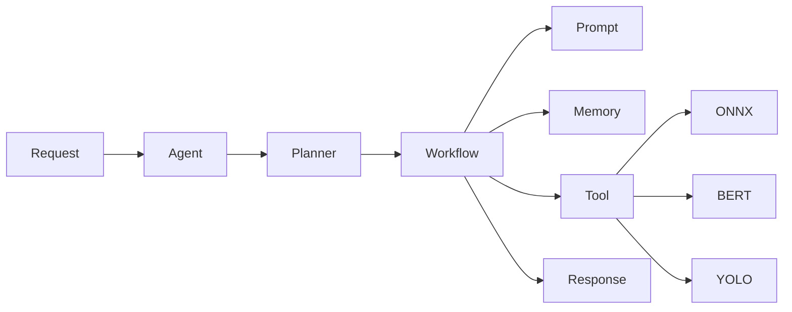

---

# 🤖 Agent

```text
Core/
└── Agent/
```

Agent 是整个框架的大脑。

所有请求最终都会进入 Agent。

Agent 不负责模型推理。

Agent 也不负责数据库。

Agent 只负责：

- 接收请求
- 创建任务
- 调用 Planner
- 调用 Workflow
- 返回结果

---

## Agent 生命周期

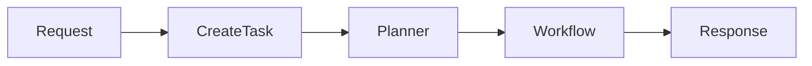

---

## Agent Responsibilities

| 功能     | 描述          |
| -------- | ------------- |
| Request  | 接收请求      |
| Planning | 创建执行计划  |
| Dispatch | 调度 Workflow |
| Execute  | 执行任务      |
| Response | 返回最终结果  |

---

# 🧩 Planner

```text
Core/
└── Planner/
```

Planner 是 Agent 的思考中心。

它不会真正执行任务。

Planner 负责：

- 判断用户意图
- 分析上下文
- 是否调用 Tool
- 是否读取 Memory
- 是否访问 Knowledge
- 是否调用 ONNX 模型

Planner 更像 CPU。

负责：

> "下一步应该干什么？"

而不是：

> "我来干。"

---

## Planner Flow

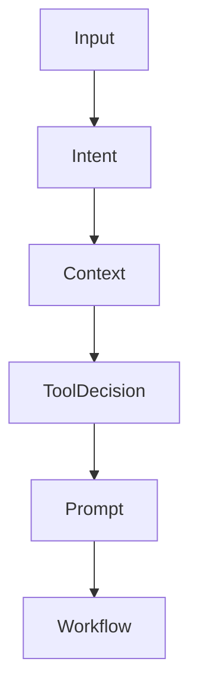

---

## Planner Responsibilities

| 功能            | 描述         |
| --------------- | ------------ |
| Intent Analysis | 用户意图分析 |
| Task Planning   | 创建任务     |
| Tool Selection  | 工具选择     |
| Memory Reading  | 读取记忆     |
| Prompt Building | Prompt 构建  |

---

# 🔄 Workflow

```text
Core/
└── Workflow/
```

Workflow 负责真正执行 Planner 制定好的计划。

整个 Workflow 基于 LangGraph 构建。

Workflow 可以认为是一条流水线。

例如：

用户：

> 帮我检测图片里的猫。

Workflow：

读取图片

-->

YOLO

-->

检测目标

-->

返回结果

再例如：

用户：

> 这句话是什么情绪？

Workflow：

文本

-->

Tokenizer

-->

BERT

-->

ONNX Runtime

-->

分类结果

Workflow 不负责思考。

Workflow 只负责：

执行。

---

## Workflow Diagram

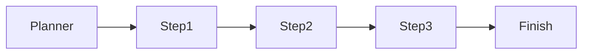

---

# 🧠 Memory

```text
Core/
└── Memory/
```

Memory 提供整个 Agent 的上下文能力。

包括：

- Session Memory
- Conversation Memory
- Long Memory

Memory 不保存业务逻辑。

Memory 只保存：

用户历史。

上下文。

推理结果。

---

## Memory Structure

```text
Memory

├── Session

├── Conversation

├── Cache

└── Long Memory
```

---

## Memory Flow

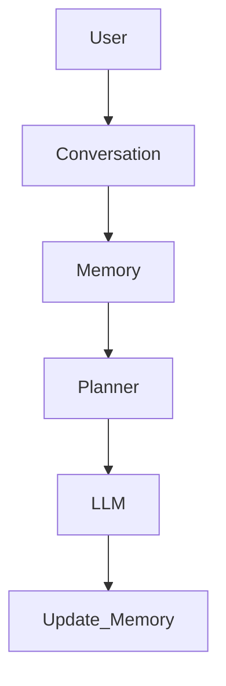

---

# 💬 Conversation

```text
Core/
└── Conversation/
```

Conversation 用于管理聊天记录。

每一次聊天都会对应：

Conversation

-->

Messages

-->

History

Conversation 可以支持：

- 新建聊天
- 删除聊天
- 查询聊天
- 历史消息
- 多轮对话

---

## Conversation Lifecycle

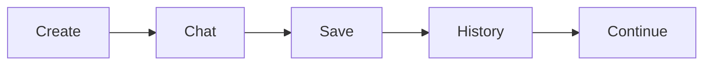

---

# 📝 Prompt

```text
Core/
└── Prompt/
```

Prompt 模块统一管理所有 Prompt。

包括：

- System Prompt
- User Prompt
- Tool Prompt
- Memory Prompt

Prompt 可以自由组合。

最终生成发送给 LLM 的 Prompt。

---

## Prompt Pipeline

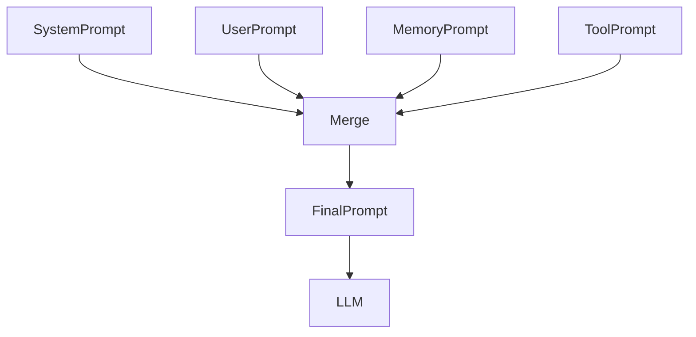

---

# ⚡ ONNX Runtime

```text
Core/
└── ONNX/
```

ONNX Runtime 提供本地 AI 推理能力。

目前支持：

- YOLO
- BERT

后续可继续扩展：

- OCR
- SAM
- CLIP
- Whisper
- 多模态模型

整个模块采用统一接口设计。

所有模型只需要实现统一的推理接口即可接入。

---

## ONNX Pipeline

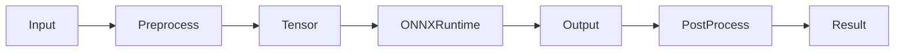

---

# 🔐 Session

Session 用于维护当前用户状态。

包括：

- 登录状态
- 当前会话
- Token
- 用户信息

Session 生命周期：

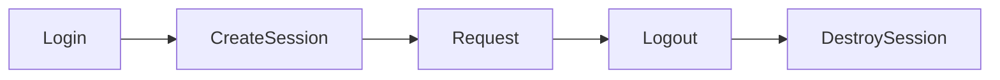

---

# 📌 Core Summary

Core 是整个 EveryoneAgent 的中枢。

它负责：

- 接收请求
- 创建任务
- 分析意图
- 调用 Workflow
- 管理 Memory
- 管理 Conversation
- 管理 Prompt
- 调用 ONNX Runtime
- 返回结果

整个 Core 层不关心具体业务实现。

所有能力均通过接口进行解耦，使系统具备良好的扩展性与可维护性。

---

# 🧩 Capability

Capability 层负责为 Agent 提供各种能力（Capability）。

Core 负责思考。

Capability 负责执行具体能力。

整个系统采用插件化设计（Plugin Architecture）。

新增任何能力时，只需要新增一个模块即可，无需修改 Agent。

---

# 🏗 Capability Architecture

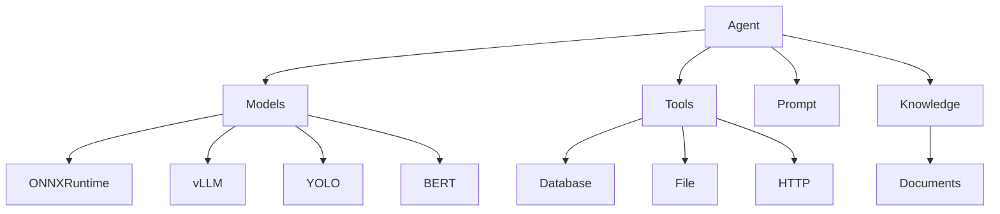

---

# 📦 Capability Structure

```text
Capability
│
├── Models
│
├── Tools
│
├── Prompts
│
└── Knowledge
```

每一个模块都遵循统一接口。

方便后续扩展。

例如：

新增 OCR：

```
Capability

└── Models

      OCR
```

无需修改其它代码。

---

# 🤖 Models

```text
Capability
└── Models
```

Models 统一管理所有 AI 模型。

目前支持：

- YOLO
- BERT
- vLLM
- Local LLM

未来可扩展：

- CLIP
- Whisper
- SAM
- OCR
- 多模态模型

所有模型均通过统一接口调用。

---

## Model Pipeline

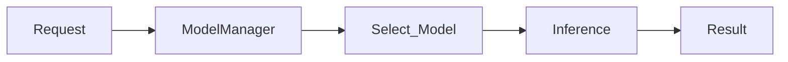

---

# ⚡ ONNX Runtime

EveryoneAgent 使用 ONNX Runtime 作为本地推理引擎。

优势：

- 部署简单
- 推理速度快
- GPU/CPU 自动切换
- 支持 Windows
- 支持 Linux
- 支持 CUDA

---

## ONNX Runtime Workflow

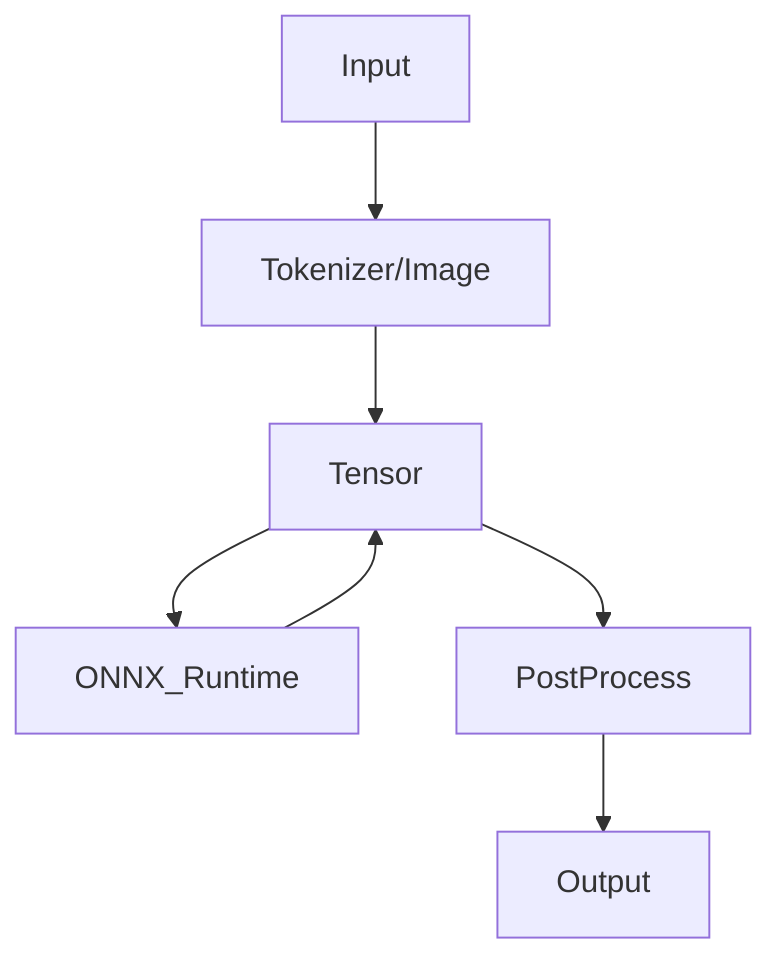

---

# 🐶 YOLO

YOLO 用于目标检测。

整个推理流程：

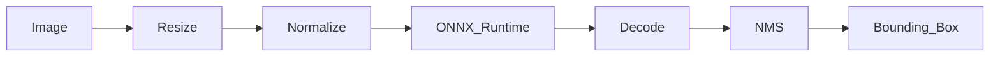

支持：

- 图片检测
- 摄像头检测
- 视频检测

未来支持：

- TensorRT
- Batch 推理
- 多 GPU

---

# 📝 BERT

BERT 用于自然语言理解。

当前主要用于：

- 文本分类
- 情感分析

整个流程：

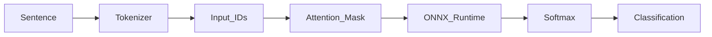

支持：

- HuggingFace 微调
- ONNX 导出
- GPU 推理
- CPU 推理

---

# 🧠 vLLM

vLLM 提供本地大语言模型服务。

整个框架统一采用 OpenAI Compatible API。

因此：

无论：

- Qwen
- Llama
- DeepSeek

均可快速接入。

---

## LLM Workflow

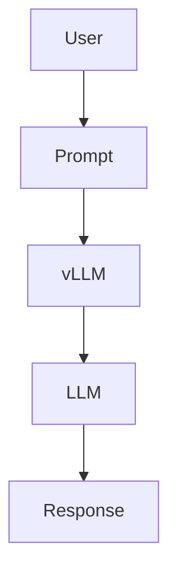

---

# 🛠 Tool Calling

Tool 是 Agent 能力扩展的重要组成部分。

Tool 不属于 Agent。

Agent 负责调用。

Tool 负责执行。

例如：

- 查询数据库
- 文件读取
- 图片分析
- 网络请求
- ONNX 推理

---

## Tool Workflow

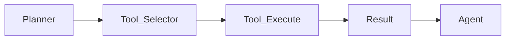

---

# 📂 Tool Structure

```text
Tools

├── DatabaseTool

├── FileTool

├── ImageTool

├── ONNXTool

├── HttpTool

└── CustomTool
```

每一个 Tool 都实现统一接口。

例如：

```python
class BaseTool:

    def execute(self):

        pass
```

这样 Agent 不需要关心具体 Tool。

---

# 📖 Prompt Templates

Prompt 统一存放于 Prompts 模块。

包括：

- System Prompt
- User Prompt
- Tool Prompt
- Memory Prompt

统一管理 Prompt 可以：

- 降低重复代码
- 提高 Prompt 可维护性
- 支持 Prompt Version

---

## Prompt Flow

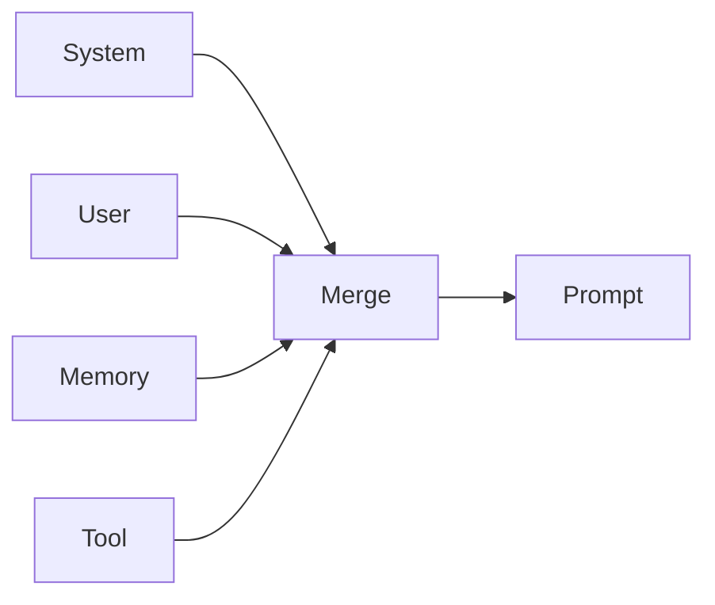

---

# 📚 Knowledge

Knowledge 提供 Agent 的知识来源。

包括：

- Documents
- FAQ
- Notes
- Manual

未来支持：

- RAG
- 向量数据库
- 文档检索
- 企业知识库

---

## Knowledge Workflow

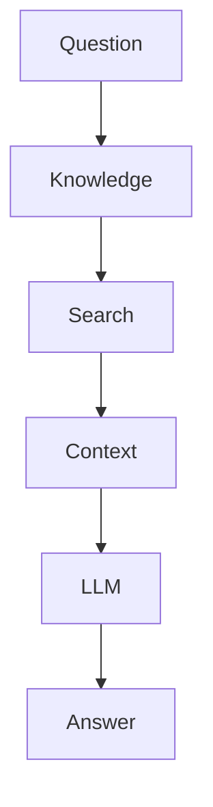

---

# 🔌 Plugin Architecture

Capability 层采用插件式架构。

所有模块均可热插拔。

例如：

```text
Capability

Models

Tool

Prompt

Knowledge

OCR

Speech

Vision

Robot
```

新增模块：

无需修改 Core。

只需要实现统一接口即可。

---

# 🎯 Capability Summary

Capability 层负责：

- AI 模型管理
- Tool 管理
- Prompt 管理
- Knowledge 管理
- 模型统一接口
- Tool Calling
- 本地 AI 推理

Core 决定"做什么"。

Capability 决定"怎么做"。

整个架构遵循：

**高内聚、低耦合、可扩展** 的设计原则。

---

# 🏗 Infrastructure

Infrastructure 是 EveryoneAgent 的基础设施层。

它负责：

- 服务运行环境
- 数据持久化
- 配置管理
- 用户管理
- 日志记录
- 系统通信

Infrastructure 不包含 AI 逻辑。

它只负责：

> "让整个 AI 系统稳定运行"

---

# Infrastructure Architecture

```mermaid
graph TD

Application

Application --> FastAPI

Application --> Database

Application --> Config

Application --> Logging

Application --> Storage

FastAPI --> Router

Router --> Service

Service --> Database

Database --> SQLite

Config --> Environment

Logging --> File
```

---

# 📂 Infrastructure Structure

```text
Infrastructure
│
├── Database
│
├── Storage
│
├── Config
│
├── Logging
│
├── API
│
└── Deployment
```

---

# 🌐 FastAPI

```text
Infrastructure/API
```

FastAPI 是整个系统的 Web 服务入口。

负责：

- HTTP 请求处理
- 用户请求转发
- API 管理
- 数据校验
- 返回 JSON

---

## FastAPI Architecture

```mermaid
graph LR

Client

-->

FastAPI

-->

Router

-->

Service

-->

Core

-->

Response
```

---

# 📡 API Layer

API 层负责定义系统接口。

主要包括：

- User API
- Authentication API
- Conversation API
- Chat API
- Model API

---

## API Design

```text
/api

├── auth

│   ├── register

│   ├── login

│   └── logout


├── conversation

│   ├── create

│   ├── list

│   ├── history


├── chat

│   └── completion


└── model

    └── inference
```

---

# 👤 User Management

用户系统负责：

- 用户注册
- 用户登录
- 用户认证
- 用户状态管理


用户生命周期：

```mermaid
graph LR

Register

-->

Create_User

-->

Login

-->

Create_Session

-->

Access_Agent

-->

Logout
```

---

# 🗄 Database

EveryoneAgent 使用数据库保存系统状态。

当前：

- SQLite
- SQLAlchemy ORM


未来可扩展：

- PostgreSQL
- MySQL
- Redis
- Vector Database

---

# Database Architecture

```mermaid
graph TD

SQLAlchemy

-->

Database_Engine

-->

SQLite

-->

Tables
```

---

# Database ER Design

```mermaid
erDiagram

USER {

int id

string username

string email

string password

}


CONVERSATION {

int id

int user_id

string title

datetime created_at

}


MESSAGE {

int id

int conversation_id

string role

text content

datetime created_at

}


USER ||--o{ CONVERSATION : owns

CONVERSATION ||--o{ MESSAGE : contains
```

---

# 👥 User Table

用户信息表。

保存：

| 字段       | 说明     |
| ---------- | -------- |
| id         | 用户ID   |
| username   | 用户名   |
| email      | 邮箱     |
| password   | 密码     |
| created_at | 创建时间 |

---

# 💬 Conversation Table

Conversation 表保存用户聊天。

作用：

- 管理历史会话
- 支持多轮对话
- 关联 Memory


字段：

| 字段       | 说明   |
| ---------- | ------ |
| id         | 会话ID |
| user_id    | 用户   |
| title      | 标题   |
| created_at | 时间   |

---

# 📨 Message Table

保存聊天消息。

例如：

```
User:

你好


Assistant:

你好，有什么可以帮助你？
```

数据：

| 字段            | 说明           |
| --------------- | -------------- |
| role            | user/assistant |
| content         | 消息内容       |
| conversation_id | 所属会话       |

---

# 💾 Storage

Storage 负责文件存储。

包括：

- 用户文件
- 图片
- 模型文件
- 文档


目录：

```text
Storage

├── uploads

├── models

├── documents

└── cache
```

---

# ⚙️ Configuration

Config 模块统一管理系统配置。

包括：

- 数据库地址
- 模型路径
- GPU配置
- 服务端口
- 环境变量


例如：

```text
Config

├── Database

├── Model

├── Server

├── Security

└── Runtime
```

---

# 📝 Logging

Logging 用于记录系统运行状态。

包括：

- API请求
- Agent执行
- Model推理
- Exception


日志流程：

```mermaid
graph LR

Request

-->

Service

-->

Logger

-->

File

```

---

# 🐳 Deployment

EveryoneAgent 支持：

- Windows
- Linux
- Docker
- GPU Server


---

# Docker Architecture

```mermaid
graph TD

Docker

Docker --> FastAPI

Docker --> vLLM

Docker --> Database

Docker --> ONNXRuntime

GPU --> CUDA

CUDA --> Container
```

---

# 💻 Local Deployment

运行环境：

```text
Python 3.10+

CUDA 12.x

PyTorch

ONNX Runtime

FastAPI

SQLite
```

启动：

```bash
pip install -r requirements.txt

python main.py
```

---

# 🚀 Production Deployment

推荐架构：

```text
                User

                 |

              Nginx

                 |

             FastAPI

                 |

        ----------------

        |              |

     Agent          vLLM

        |

   ONNX Runtime

        |

      GPU
```

---

# Infrastructure Summary

Infrastructure 层保证整个系统：

- 稳定运行
- 数据保存
- 用户管理
- 服务通信
- 配置统一
- 日志追踪
- 部署方便


它是 AI Agent 系统的工程基础。

---

# 📚 Knowledge

Knowledge 是 EveryoneAgent 的知识管理层。

它负责给 Agent 提供外部知识能力。

区别于普通聊天机器人：

Agent 不仅依赖模型自身参数。

还可以通过 Knowledge 获取：

- 文档
- 数据
- 企业知识
- 专业资料
- 用户信息

---

# Knowledge Architecture

```mermaid
graph TD

User

-->

Question

-->

Knowledge

-->

Retriever

-->

Context

-->

Prompt

-->

LLM

-->

Answer
```

---

# Knowledge Structure

```text
Knowledge

├── Documents

│
├── Index

│
├── Retriever

│
└── VectorStore
```

---

# 📄 Documents

Documents 保存原始知识。

支持：

- PDF
- Markdown
- TXT
- Code
- Web Content


流程：

```mermaid
graph LR

Document

-->

Loader

-->

Parser

-->

Chunk

-->

Index
```

---

# 🔎 Index

Index 负责建立知识索引。

作用：

- 提高查询速度
- 文档分块
- 内容检索


---

# 🧠 VectorStore

未来支持：

- FAISS
- Milvus
- PostgreSQL Vector


流程：

```mermaid
graph LR

Text

-->

Embedding

-->

Vector

-->

Database

-->

Similarity_Search
```

---

# 🤖 Complete Agent Workflow

EveryoneAgent 的完整执行流程：

```mermaid
sequenceDiagram

participant User

participant API

participant Agent

participant Planner

participant Memory

participant Knowledge

participant LLM

participant Tool


User->>API: Input Message

API->>Agent: Create Task

Agent->>Memory: Load History

Memory-->>Agent: Context


Agent->>Planner: Analyze Task


Planner->>Knowledge: Search Knowledge


Knowledge-->>Planner: Relevant Context


Planner->>LLM: Build Prompt


LLM-->>Planner: Reasoning


Planner->>Tool: Execute Tool


Tool-->>Planner: Result


Planner->>Memory: Save Result


Planner-->>Agent: Final Answer


Agent-->>API: Response


API-->>User: Output

```

---

# 🧠 Agent Decision Process

Agent 根据任务自动选择能力。

例如：

---

## 普通聊天

```mermaid
graph TD

User

-->

Agent

-->

LLM

-->

Answer
```

---

## 图片检测

```mermaid
graph LR

User

-->

Agent

-->

YOLO_Tool

-->

ONNX_Runtime

-->

Detection_Result

-->

Answer
```

---

## 文本分类

```mermaid
graph LR

User

-->

Agent

-->

BERT_Tool

-->

Tokenizer

-->

ONNX_Runtime

-->

Classification

-->

Answer
```

---

## 知识问答

```mermaid
graph LR

User

-->

Knowledge_Search

-->

Retrieve_Context

-->

LLM

-->

Answer
```

---

# 🔥 Multi Capability Workflow

```mermaid
graph TD


User

User --> Agent


Agent --> Decision


Decision --> Chat

Decision --> Vision

Decision --> NLP

Decision --> Knowledge


Chat --> LLM

Vision --> YOLO

NLP --> BERT

Knowledge --> VectorStore


LLM --> Response

YOLO --> Response

BERT --> Response

VectorStore --> Response

```

---

# 🛠 Development Guide

## Environment

推荐环境：

```text
Python >= 3.10

CUDA >= 12

PyTorch

ONNX Runtime

FastAPI

SQLAlchemy
```

---

# Installation

Clone project:

```bash
git clone https://github.com/yourname/EveryoneAgent.git

cd EveryoneAgent
```

---

Install dependencies:

```bash
pip install -r requirements.txt
```

---

# Configuration

修改配置文件：

```text
config/

├── database.yaml

├── model.yaml

├── server.yaml

└── runtime.yaml
```

---

# Start Service

```bash
python main.py
```

服务启动：

```text
http://localhost:8000
```

---

# 🧪 Testing

测试模块：

```text
tests

├── test_agent.py

├── test_memory.py

├── test_api.py

├── test_model.py

└── test_database.py
```

---

# 📊 Performance Design

EveryoneAgent 关注：

## 模型推理优化

支持：

- ONNX Runtime
- CUDA Execution Provider
- TensorRT


---

## 服务优化

支持：

- Async API
- Session Management
- Model Cache


---

## 工程优化

采用：

- 模块解耦
- 分层设计
- 接口抽象

---

# 🗺 Roadmap

## Completed ✅

- [x] FastAPI Web Framework

- [x] User Authentication

- [x] Conversation System

- [x] SQLite Database

- [x] SQLAlchemy ORM

- [x] Agent Framework

- [x] Planner

- [x] Workflow

- [x] Memory

- [x] Prompt Management

- [x] Tool System

- [x] ONNX Runtime

- [x] YOLO Detection

- [x] BERT Classification

- [x] vLLM Integration


---

## Future 🚀

- [ ] RAG System

- [ ] Vector Database

- [ ] Multi Agent

- [ ] MCP Protocol

- [ ] Voice Assistant

- [ ] Vision Language Model

- [ ] Mobile Client

- [ ] Robot Integration


---

# 🌟 Project Highlights

## Modular Architecture

所有模块独立。

方便扩展。

---

## Local AI

支持：

- 本地模型
- 本地推理
- GPU 加速


---

## Full Stack AI System

不仅包含模型。

还包含：

- Web
- Backend
- Database
- Agent
- Deployment


---

# 🤝 Contribution

欢迎提交：

- Issue
- Feature Request
- Pull Request


贡献方向：

- 新模型支持
- 新 Tool
- 新 Workflow
- 性能优化


---

# 📜 License

This project is licensed under the MIT License.

---

# ⭐ Star History

如果 EveryoneAgent 对你有帮助：

欢迎 Star ⭐

你的支持是项目持续发展的动力。


---

# ❤️ About

EveryoneAgent 的目标：

> Build an open, modular and local AI Agent framework.

让每个人都可以拥有属于自己的 AI Agent。
